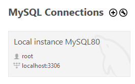
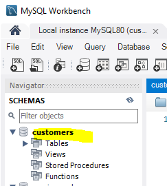

# Node Express Example Project

## Description

This is a very small project that demonstrates a node.js express framework backend that follows the MVC (model, view, controller) design paradigm. It utilizes EJS for html rendering as well. 

Follow the steps below to start it up.

## Setup initial project

1. Clone the repository:

`git clone https://github.com/mv805/backend-example-node-express.git`

2. Navigate into the project directory:

`cd <yourprojectpath>`

3. Install the dependencies:

`npm install`

## Setup Database

You will need to first setup your database on your local machine for demo purposes. 

1. Login to mysql workbench
2. You should see the environment that was setup when you installed it.

3. record the port. The host should be 'localhost' and user 'root'. If its different, just record whatever it is. You will need your password as well.

4. go to the database folder, copy all the 'Dump20240117' sql code to the clipboard.

5. login to your database on local host through the workbench. Start a new query and paste the data from the database file.

6. Run the query, this should setup your db. Confirm that 'customers' database was created and some users are in it.
   
`SELECT * FROM customers.customers;`

8. Go to the file db.js, you will see you the login info is referencing a .env file. You need this file so that you can hide your login details in database so we never show it on the repository (people will steal it).

9. Go to the .env.example file. this is a file I made showing how the file should be setup. 

10. create a .env file (just name it like that, .env) in your root directory. copy paste the example contents but put in your password and update other info if needed, including the port.

> [!CAUTION]
You can lookup what .env file is for but make sure you add its included in gitignore ( I did add it by default but double check). you never want to commit the .env file to the repository because those are secret fields.

## Start the server

Now you are ready to start. 

`npm start`

it should start the server on your https://localhost:3000. If needed, you can change the port in app.js.

## Questions????
Contact me if you have any questions at all about the code or how it works.

